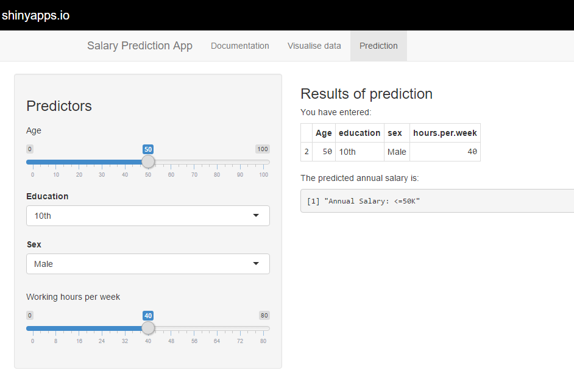
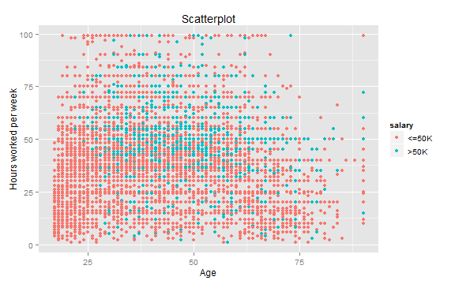

<!-- Limit image width and height -->

<!-- Center image on slide -->

## About this App

1. The data set for this project is from the UCI Machine Learning Repository: http://archive.ics.uci.edu/ml/datasets/Adult

2. The shiny app is hosted on the shinyapps io server: https://jlkw.shinyapps.io/jlkwCourseraDevDataProducts

3. This app contains a data visualisation feature and a salary prediction feature

--- .class #id 

## Salary Prediction 

1. The App's main feature is to return a salary prediction either:
  + > 50K or 
  + <= 50K

2. The underlying prediction is based on the random forest prediction model which is trained based on the UCI data set.
3. Salary is predicted by 4 predictors: age, education, sex and hours worked per week

--- .class #id 

## Salary Prediction UI
Simply select the predictor values on the Predictor panel on the left. The result of your prediction will be shown on the right.

--- .class #id 

## Data Visualisation Feature

1. Users will be able to view a scatterplot of key attributes of the data set.

2. Users will be able to interactively select the two attributes for the scatterplot.  

3. One such scatterplot example is as shown:

