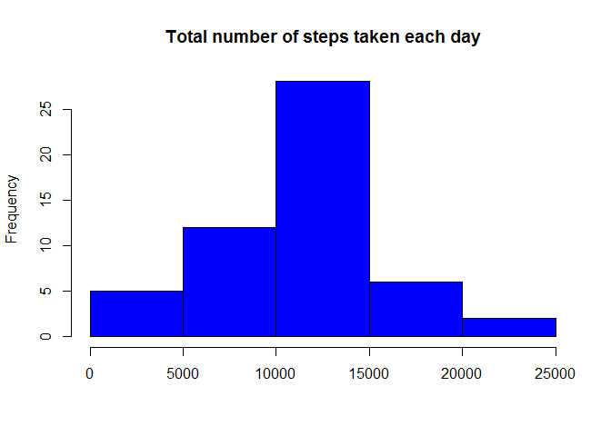
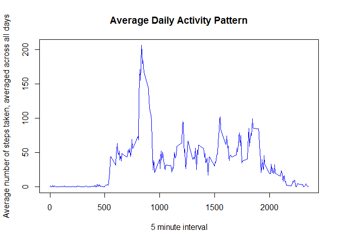
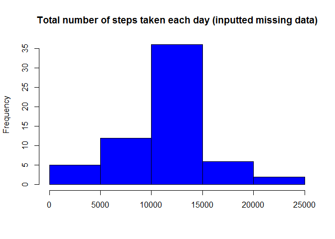

# Reproducible Research: Peer Assessment 1

## Loading and preprocessing the data

```r
library(dplyr)
```


```r
if (!file.exists(file.path(getwd(),"activity.csv"))){
  unzip(file.path(getwd(),"activity.zip"),
        exdir=file.path(getwd()))
}

activityDataRaw <- tbl_df(read.csv(file.path(getwd(),"activity.csv"),stringsAsFactors=FALSE))
activityData <- filter(activityDataRaw,steps!="NA")
activityData$date <- as.Date(activityData$date,"%Y-%m-%d")

activityData
```

```
## Source: local data frame [15,264 x 3]
## 
##    steps       date interval
## 1      0 2012-10-02        0
## 2      0 2012-10-02        5
## 3      0 2012-10-02       10
## 4      0 2012-10-02       15
## 5      0 2012-10-02       20
## 6      0 2012-10-02       25
## 7      0 2012-10-02       30
## 8      0 2012-10-02       35
## 9      0 2012-10-02       40
## 10     0 2012-10-02       45
## ..   ...        ...      ...
```

## What is mean total number of steps taken per day?

To calculate the total number of steps taken per day:

```r
totalStepsTakenPerDay <- group_by(activityData,date) %>%
                    summarise(total_steps=sum(steps))
totalStepsTakenPerDay
```

```
## Source: local data frame [53 x 2]
## 
##          date total_steps
## 1  2012-10-02         126
## 2  2012-10-03       11352
## 3  2012-10-04       12116
## 4  2012-10-05       13294
## 5  2012-10-06       15420
## 6  2012-10-07       11015
## 7  2012-10-09       12811
## 8  2012-10-10        9900
## 9  2012-10-11       10304
## 10 2012-10-12       17382
## ..        ...         ...
```


To make a histogram of the total number of steps taken each day: 

```r
hist(totalStepsTakenPerDay$total_steps,xlab="",main="Total number of steps taken each day",col="blue")
```

 


Mean of the total number of steps taken per day:

```r
mean(totalStepsTakenPerDay$total_steps)
```

```
## [1] 10766.19
```


Median of the total number of steps taken per day:

```r
median(totalStepsTakenPerDay$total_steps)
```

```
## [1] 10765
```


## What is the average daily activity pattern?

The time series plot of the 5-minute interval (x-axis) and the average number of steps taken, averaged across all days (y-axis):


```r
dailyActivityPatternTable <- group_by(activityData,interval)%>%
                              summarise(average_steps=mean(steps))

plot(x=dailyActivityPatternTable$interval,y=dailyActivityPatternTable$average_steps,
     type="l", main="Average Daily Activity Pattern",
     xlab="5 minute interval",
     ylab="Average number of steps taken, averaged across all days",col="blue")
```

 


The 5-minute interval, on average across all the days in the dataset, which contains the maximum number of steps:

```r
dailyActivityPatternTable[which.max(dailyActivityPatternTable$average_steps),]
```

```
## Source: local data frame [1 x 2]
## 
##   interval average_steps
## 1      835      206.1698
```


## Imputing missing values
Total number of missing values in the dataset

```r
nrow(activityDataRaw[is.na(activityDataRaw$steps),])
```

```
## [1] 2304
```

Create new dataset by filling missing values with the average number of steps (across all days), for that 5-minute interval:

```r
activityDataFilled <- tbl_df(merge(x=activityDataRaw,
                            y=dailyActivityPatternTable,
                            by.x="interval",by.y="interval"))

activityDataFilled$steps[which(is.na(activityDataFilled$steps))]=
  activityDataFilled$average_steps[which(is.na(activityDataFilled$steps))]

activityDataFilled$date <- as.Date(activityDataFilled$date,"%Y-%m-%d")

activityDataFilled
```

```
## Source: local data frame [17,568 x 4]
## 
##    interval    steps       date average_steps
## 1         0 1.716981 2012-10-01      1.716981
## 2         0 0.000000 2012-11-23      1.716981
## 3         0 0.000000 2012-10-28      1.716981
## 4         0 0.000000 2012-11-06      1.716981
## 5         0 0.000000 2012-11-24      1.716981
## 6         0 0.000000 2012-11-15      1.716981
## 7         0 0.000000 2012-10-20      1.716981
## 8         0 0.000000 2012-11-16      1.716981
## 9         0 0.000000 2012-11-07      1.716981
## 10        0 0.000000 2012-11-25      1.716981
## ..      ...      ...        ...           ...
```


Histogram of the total number of steps taken each day:

```r
totalStepsTakenPerDayFilled <- tbl_df(activityDataFilled) %>%
                                group_by(date) %>%
                                summarise(total_steps=sum(steps))

hist(totalStepsTakenPerDayFilled$total_steps,xlab="",main="Total number of steps taken each day (inputted missing data)",col="blue")
```

 


Mean total number of steps taken per day:

```r
mean(totalStepsTakenPerDayFilled$total_steps)
```

```
## [1] 10766.19
```


Median total number of steps taken per day:

```r
median(totalStepsTakenPerDayFilled$total_steps)
```

```
## [1] 10766.19
```

There is no impact of inputing missing data on the mean. However, inputing missing data increases the median.


## Are there differences in activity patterns between weekdays and weekends?

Create ```Weekday``` and ```Weekend``` factor variables in the dataset

```r
weekTable <- data.frame(Weekday=c("Monday","Tuesday","Wednesday","Thursday","Friday","Saturday","Sunday"),
           WeekEndOrDay=c("Weekday","Weekday","Weekday","Weekday","Weekday","Weekend","Weekend"))

activityDataFilledWithWeekInfo <- tbl_df(activityDataFilled) %>%
                                    mutate(Weekday=weekdays(date))

dailyActivityPatternWithWeekInfo <- tbl_df(merge(x=activityDataFilledWithWeekInfo,
                                                 y=weekTable,by="Weekday")) %>%
                                    group_by(interval,WeekEndOrDay) %>%
                                    summarise(average_steps=mean(steps))

dailyActivityPatternWithWeekInfo
```

```
## Source: local data frame [576 x 3]
## Groups: interval
## 
##    interval WeekEndOrDay average_steps
## 1         0      Weekday   2.251153040
## 2         0      Weekend   0.214622642
## 3         5      Weekday   0.445283019
## 4         5      Weekend   0.042452830
## 5        10      Weekday   0.173165618
## 6        10      Weekend   0.016509434
## 7        15      Weekday   0.197903564
## 8        15      Weekend   0.018867925
## 9        20      Weekday   0.098951782
## 10       20      Weekend   0.009433962
## ..      ...          ...           ...
```


Panel plot containing a time series plot of the 5-minute interval (x-axis) and the average number of steps taken, averaged across all weekday days or weekend days (y-axis):

```r
library(lattice)
xyplot(average_steps~interval|WeekEndOrDay,data=dailyActivityPatternWithWeekInfo,
            layout=c(1,2),type="l",xlab="Interval",ylab="Number of steps")
```

 
