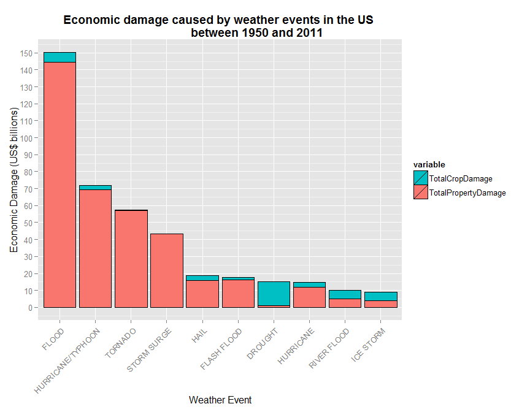

# Reproducible Research: Peer assessment 2 - Impact of Severe Weather Events in the US Between 1950 and 2011

## Sypnosis

### Background

The aim of this project is to explore the NOAA Storm Database and identify the types of events which are most damaging to population health and the economy.

This helps stakeholders such as the government, municipal manager etc to prioritise their resources allocated towards these events. 

### Data source

Data can be downloaded from the NOAA Storm Database at: <https://d396qusza40orc.cloudfront.net/repdata%2Fdata%2FStormData.csv.bz2>

More information regarding the database can be found here: <http://www.ncdc.noaa.gov/stormevents/choosedates.jsp?statefips=-999%2CALL>


## Data Processing

Firstly, load all the packages we need:

```r
library(dplyr)
library(ggplot2)
library(reshape2)
```

Secondly, read the data into a data frame.

```r
stormDataRaw <- read.csv(bzfile(file.path(getwd(),"repdata-data-StormData.csv.bz2")),
                         stringsAsFactors=FALSE)

stormDataRaw$EVTYPE <- as.factor(stormDataRaw$EVTYPE)
stormData <- tbl_df(stormDataRaw)
str(stormData)
```

```
## Classes 'tbl_df', 'tbl' and 'data.frame':	902297 obs. of  37 variables:
##  $ STATE__   : num  1 1 1 1 1 1 1 1 1 1 ...
##  $ BGN_DATE  : chr  "4/18/1950 0:00:00" "4/18/1950 0:00:00" "2/20/1951 0:00:00" "6/8/1951 0:00:00" ...
##  $ BGN_TIME  : chr  "0130" "0145" "1600" "0900" ...
##  $ TIME_ZONE : chr  "CST" "CST" "CST" "CST" ...
##  $ COUNTY    : num  97 3 57 89 43 77 9 123 125 57 ...
##  $ COUNTYNAME: chr  "MOBILE" "BALDWIN" "FAYETTE" "MADISON" ...
##  $ STATE     : chr  "AL" "AL" "AL" "AL" ...
##  $ EVTYPE    : Factor w/ 985 levels "   HIGH SURF ADVISORY",..: 834 834 834 834 834 834 834 834 834 834 ...
##  $ BGN_RANGE : num  0 0 0 0 0 0 0 0 0 0 ...
##  $ BGN_AZI   : chr  "" "" "" "" ...
##  $ BGN_LOCATI: chr  "" "" "" "" ...
##  $ END_DATE  : chr  "" "" "" "" ...
##  $ END_TIME  : chr  "" "" "" "" ...
##  $ COUNTY_END: num  0 0 0 0 0 0 0 0 0 0 ...
##  $ COUNTYENDN: logi  NA NA NA NA NA NA ...
##  $ END_RANGE : num  0 0 0 0 0 0 0 0 0 0 ...
##  $ END_AZI   : chr  "" "" "" "" ...
##  $ END_LOCATI: chr  "" "" "" "" ...
##  $ LENGTH    : num  14 2 0.1 0 0 1.5 1.5 0 3.3 2.3 ...
##  $ WIDTH     : num  100 150 123 100 150 177 33 33 100 100 ...
##  $ F         : int  3 2 2 2 2 2 2 1 3 3 ...
##  $ MAG       : num  0 0 0 0 0 0 0 0 0 0 ...
##  $ FATALITIES: num  0 0 0 0 0 0 0 0 1 0 ...
##  $ INJURIES  : num  15 0 2 2 2 6 1 0 14 0 ...
##  $ PROPDMG   : num  25 2.5 25 2.5 2.5 2.5 2.5 2.5 25 25 ...
##  $ PROPDMGEXP: chr  "K" "K" "K" "K" ...
##  $ CROPDMG   : num  0 0 0 0 0 0 0 0 0 0 ...
##  $ CROPDMGEXP: chr  "" "" "" "" ...
##  $ WFO       : chr  "" "" "" "" ...
##  $ STATEOFFIC: chr  "" "" "" "" ...
##  $ ZONENAMES : chr  "" "" "" "" ...
##  $ LATITUDE  : num  3040 3042 3340 3458 3412 ...
##  $ LONGITUDE : num  8812 8755 8742 8626 8642 ...
##  $ LATITUDE_E: num  3051 0 0 0 0 ...
##  $ LONGITUDE_: num  8806 0 0 0 0 ...
##  $ REMARKS   : chr  "" "" "" "" ...
##  $ REFNUM    : num  1 2 3 4 5 6 7 8 9 10 ...
```

Next, we need convert scalers into a numerical format (eg."k" represents 1,000). We use the unique function to look at the list of scalers we need to handle in relation to PROPDMG


```r
unique(stormData$PROPDMGEXP)
```

```
##  [1] "K" "M" ""  "B" "m" "+" "0" "5" "6" "?" "4" "2" "3" "h" "7" "H" "-"
## [18] "1" "8"
```

Based on this list of scalers, we do the numeric conversion accordingly.


```r
stormData[stormData$PROPDMGEXP=="H"|stormData$PROPDMGEXP=="h","PROPDMGEXP"] <- 100
stormData[stormData$PROPDMGEXP=="K","PROPDMGEXP"] <- 1000
stormData[stormData$PROPDMGEXP=="M"|stormData$PROPDMGEXP=="m","PROPDMGEXP"] <- 1000000
stormData[stormData$PROPDMGEXP=="B","PROPDMGEXP"] <- 1000000000
stormData[stormData$PROPDMGEXP=="0","PROPDMGEXP"] <- 10
stormData[stormData$PROPDMGEXP=="1","PROPDMGEXP"] <- 10
stormData[stormData$PROPDMGEXP=="2","PROPDMGEXP"] <- 10
stormData[stormData$PROPDMGEXP=="3","PROPDMGEXP"] <- 10
stormData[stormData$PROPDMGEXP=="4","PROPDMGEXP"] <- 10
stormData[stormData$PROPDMGEXP=="5","PROPDMGEXP"] <- 10
stormData[stormData$PROPDMGEXP=="6","PROPDMGEXP"] <- 10
stormData[stormData$PROPDMGEXP=="7","PROPDMGEXP"] <- 10
stormData[stormData$PROPDMGEXP=="8","PROPDMGEXP"] <- 10
stormData[stormData$PROPDMGEXP=="","PROPDMGEXP"] <- 1
stormData[stormData$PROPDMGEXP=="+","PROPDMGEXP"] <- 1
stormData[stormData$PROPDMGEXP=="-","PROPDMGEXP"] <- 1
stormData[stormData$PROPDMGEXP=="?","PROPDMGEXP"] <- 1

stormData$PROPDMGEXP <- as.numeric(stormData$PROPDMGEXP)
stormData <- mutate(stormData,property_damage=PROPDMG*PROPDMGEXP)
```

We repeat the steps to handle the scalers in relation to CROPDMG. First look at the list of scalers to determine what we have to convert.


```r
unique(stormData$CROPDMGEXP)
```

```
## [1] ""  "M" "K" "m" "B" "?" "0" "k" "2"
```

Based on this list of scalers, we do the numeric conversion accordingly.


```r
stormData[stormData$CROPDMGEXP=="K"|stormData$CROPDMGEXP=="k","CROPDMGEXP"] <- 1000
stormData[stormData$CROPDMGEXP=="M"|stormData$CROPDMGEXP=="m","CROPDMGEXP"] <- 1000000
stormData[stormData$CROPDMGEXP=="B","CROPDMGEXP"] <- 1000000000
stormData[stormData$CROPDMGEXP=="0","CROPDMGEXP"] <- 10
stormData[stormData$CROPDMGEXP=="2","CROPDMGEXP"] <- 10
stormData[stormData$CROPDMGEXP=="","CROPDMGEXP"] <- 1
stormData[stormData$CROPDMGEXP=="?","CROPDMGEXP"] <- 1

stormData$CROPDMGEXP <- as.numeric(stormData$CROPDMGEXP)
stormData <- mutate(stormData,crop_damage=CROPDMG*CROPDMGEXP)
```


## Results

### 1. Across the United States, which types of events are most harmful with respect to population health? 

Our objective is to see the fatalities and injuries caused by each weather event. 


```r
healthDmgTable <- group_by(stormData,EVTYPE) %>%
                  summarise(fatalities=sum(FATALITIES),injuries=sum(INJURIES))%>%
                  arrange(desc(fatalities+injuries))%>%
                  mutate(Total=fatalities+injuries)
head(healthDmgTable,10)
```

```
## Source: local data frame [10 x 4]
## 
##               EVTYPE fatalities injuries Total
## 1            TORNADO       5633    91346 96979
## 2     EXCESSIVE HEAT       1903     6525  8428
## 3          TSTM WIND        504     6957  7461
## 4              FLOOD        470     6789  7259
## 5          LIGHTNING        816     5230  6046
## 6               HEAT        937     2100  3037
## 7        FLASH FLOOD        978     1777  2755
## 8          ICE STORM         89     1975  2064
## 9  THUNDERSTORM WIND        133     1488  1621
## 10      WINTER STORM        206     1321  1527
```
From the table above, we observe that tornadoes historically cause the greatest harm to population health in terms of fatalities and injuries.

To take a step further, we want to represent the fatalities and injuries caused by each weather event visually in the form of a stacked bar chart. However, due to space constraints we will only plot the top 10 events.  

To do that we have to convert the data to long format using the melt function from the reshape2 package:


```r
healthDmgTableLong <- melt(healthDmgTable[1:10,1:3],id.vars="EVTYPE")
healthDmgTableLong
```

```
##               EVTYPE   variable value
## 1            TORNADO fatalities  5633
## 2     EXCESSIVE HEAT fatalities  1903
## 3          TSTM WIND fatalities   504
## 4              FLOOD fatalities   470
## 5          LIGHTNING fatalities   816
## 6               HEAT fatalities   937
## 7        FLASH FLOOD fatalities   978
## 8          ICE STORM fatalities    89
## 9  THUNDERSTORM WIND fatalities   133
## 10      WINTER STORM fatalities   206
## 11           TORNADO   injuries 91346
## 12    EXCESSIVE HEAT   injuries  6525
## 13         TSTM WIND   injuries  6957
## 14             FLOOD   injuries  6789
## 15         LIGHTNING   injuries  5230
## 16              HEAT   injuries  2100
## 17       FLASH FLOOD   injuries  1777
## 18         ICE STORM   injuries  1975
## 19 THUNDERSTORM WIND   injuries  1488
## 20      WINTER STORM   injuries  1321
```

Once we have the data in the right format, we are ready to plot the bar chart:


```r
healthDamage <- ggplot(data=healthDmgTableLong,
                        aes(x=reorder(EVTYPE,-value),y=value,fill=variable,order=-value))+
              geom_bar(stat="identity",position="stack",colour="black")+
              labs(x="Weather Event",y="Fatalities/Injuries Count",
                   title="Harm to population health caused by 
                          weather events in the US between 1950 and 2011")+
              theme(axis.text.x=element_text(angle=45,hjust=1),
                    plot.title=element_text(face="bold",vjust=1))+
              scale_y_continuous(breaks=seq(0,100000,by=5000))

healthDamage
```

 

```r
# Note: The plot shows the top 10 weather events which cause the most harm to population health in terms of the number of fatalities and injuries caused.
```

Visually, we can observe that tornadoes cause the greatest harm to population health in terms of the number of fatalities and injuries caused. Besides tornadoes, other harmful weather events are excessive heat, tstm wind and so fourth.

### 2. Across the United States, which types of events have the greatest economic consequences?

Our objective is to see the property and crop damage caused by each weather event.


```r
economicDmgTable <- group_by(stormData,EVTYPE)%>%
                    summarise(TotalPropertyDamage=sum(property_damage)/10^9,
                              TotalCropDamage=sum(crop_damage)/10^9)%>%
                    arrange(desc(TotalPropertyDamage+TotalCropDamage))%>%
                    mutate(TotalDamage=TotalPropertyDamage+TotalCropDamage)

economicDmgTable
```

```
## Source: local data frame [985 x 4]
## 
##               EVTYPE TotalPropertyDamage TotalCropDamage TotalDamage
## 1              FLOOD          144.657710       5.6619684  150.319678
## 2  HURRICANE/TYPHOON           69.305840       2.6078728   71.913713
## 3            TORNADO           56.937163       0.4149547   57.352118
## 4        STORM SURGE           43.323536       0.0000050   43.323541
## 5               HAIL           15.732270       3.0259547   18.758225
## 6        FLASH FLOOD           16.140815       1.4213171   17.562132
## 7            DROUGHT            1.046106      13.9725660   15.018672
## 8          HURRICANE           11.868319       2.7419100   14.610229
## 9        RIVER FLOOD            5.118945       5.0294590   10.148404
## 10         ICE STORM            3.944928       5.0221135    8.967042
## ..               ...                 ...             ...         ...
```

```r
# The numbers shown are in US$ billions.
```
From the table above, we observe that floods have the greatest economic consequences in terms of property and crop damage.

To take a step further, we want to represent the property and crop damage caused by each weather event visually in the form of a stacked bar chart. However, due to space constraints we will only plot the top 10 events. 

To do that we have to convert the data to long format using the melt function from the reshape2 package:


```r
economicDmgTableLong <- melt(economicDmgTable[1:10,1:3],id.vars="EVTYPE")
economicDmgTableLong
```

```
##               EVTYPE            variable       value
## 1              FLOOD TotalPropertyDamage 144.6577098
## 2  HURRICANE/TYPHOON TotalPropertyDamage  69.3058400
## 3            TORNADO TotalPropertyDamage  56.9371629
## 4        STORM SURGE TotalPropertyDamage  43.3235360
## 5               HAIL TotalPropertyDamage  15.7322699
## 6        FLASH FLOOD TotalPropertyDamage  16.1408152
## 7            DROUGHT TotalPropertyDamage   1.0461060
## 8          HURRICANE TotalPropertyDamage  11.8683190
## 9        RIVER FLOOD TotalPropertyDamage   5.1189455
## 10         ICE STORM TotalPropertyDamage   3.9449283
## 11             FLOOD     TotalCropDamage   5.6619684
## 12 HURRICANE/TYPHOON     TotalCropDamage   2.6078728
## 13           TORNADO     TotalCropDamage   0.4149547
## 14       STORM SURGE     TotalCropDamage   0.0000050
## 15              HAIL     TotalCropDamage   3.0259547
## 16       FLASH FLOOD     TotalCropDamage   1.4213171
## 17           DROUGHT     TotalCropDamage  13.9725660
## 18         HURRICANE     TotalCropDamage   2.7419100
## 19       RIVER FLOOD     TotalCropDamage   5.0294590
## 20         ICE STORM     TotalCropDamage   5.0221135
```

Once the data is in the long format, we can plot our stacked bar chart:


```r
economicDmg <- ggplot(data=economicDmgTableLong,
                      aes(x=reorder(EVTYPE,-value),y=value,fill=variable))+
                geom_bar(stat="identity",position="stack",colour="black")+
                labs(x="Weather Event",y="Economic Damage (US$ billions)",
                title="Economic damage caused by weather events in the US 
                        between 1950 and 2011")+
                theme(axis.text.x=element_text(angle=45,hjust=1),
                      plot.title=element_text(face="bold"))+
                scale_fill_discrete(guide=guide_legend(reverse=TRUE))+
                scale_y_continuous(breaks=seq(0,170,by=10))
economicDmg
```

 

```r
# Note: The plot shows the top 10 weather events which cause the most economic damage in terms of property and crop damage (in US$ billions)
```

Visually we can observe that floods historically cause the greatest economic damage in monetary terms. Besides floods, other economically damaging events are hurricanes/typhoons, tornadoes and so fourth.

