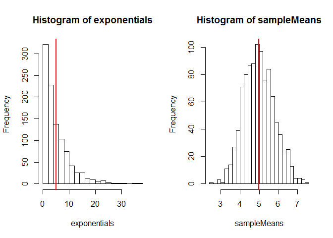
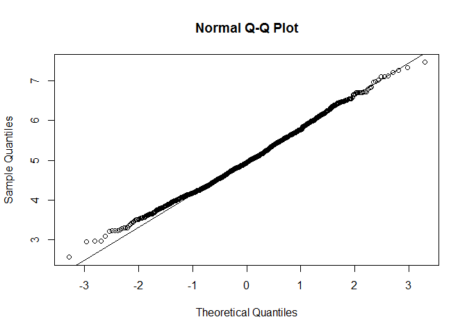

# Statistical Inference Course Project: Convergence of expoential distribution to normal under CLT

# Overview
Our goal in this project is to investigate the result of the central limit theorem.
To do so, We would run simulations in R to simulate the drawing of samples from an 
exponential distribution. 

Each time we will draw 40 samples and compute it's mean. We will repeat this process for 
1,000 times. 

We would then compare the distribution of the sample mean with the normal distribution.

# Simulations
Our simulation performs the following:
1) Draw 40 samples from an exponential distribution and compute the sample mean.
2) Repeat this sampling process 1,000 times to obtain a distribution of the sample mean.


```r
set.seed(3)

sampleMeans <- NULL

nScenarios <- 1000 # We will repeat our sampling 1000 times

for (i in 1:nScenarios){
  # each time we would draw 40 samples from the exponential distribution with lambda=0.2
  sampleMeans <- c(sampleMeans, mean(rexp(40,0.2)))
}
```

# Sample Mean versus Theoretical Mean
The theoretical mean of the exponential distribution is 1/lambda = 5, given that lambda is 0.2.

From theory, we know that the mean of the sample mean equals the theoretical mean.
Therefore, the mean of the sample mean based on our simulations should give us a result close to the theoretical mean.


```r
# Theoretical mean = 1/lambda
1/0.2
```

```
## [1] 5
```

```r
# Sample mean 
mean(sampleMeans)
```

```
## [1] 4.98662
```


To see the results visually, we can compare the mean of samples taken from the exponential distribution against the sample means distribution.


```r
set.seed(4)
par(mfrow=c(1,2))
exponentials <- rexp(1000,0.2) #1,000 samples from an exponential distribution
hist(exponentials,breaks=20)
abline(v = mean(exponentials),col='red',lwd=2) # draw a red line where the mean is

hist(sampleMeans,breaks=20)
abline(v=mean(sampleMeans),col='red',lwd=2) # draw a red line where the mean is
```

 


# Sample Variance versus Theoretical Variance
The theoretical variance of the exponential distribution is 1/lambda^2 = 25, given that lambda is 0.2.

From theory we know that the variance of the sample mean equals the theoretical variance divided by the sample size.

The sample size*variance of the sample mean based on our simulations should give us a result close to the theoretical variance.


```r
# Theoretical variance = 1/lambda^2
1/0.2^2
```

```
## [1] 25
```

```r
# variance of sample mean*sample size
var(sampleMeans)*40
```

```
## [1] 25.26715
```


# Distribution
Finally to investigate if the distribution of the sample means are normal, we perform a quantille-quantile plot (qq-plot).

The qq-plot compares the quantiles of the sample means distribution against the quantiles of the normal distribution.

We observe that the data points lie on a straight line which is indicative that the distribution is approximately normal.


```r
qqnorm(sampleMeans)
qqline(sampleMeans)
```

 
