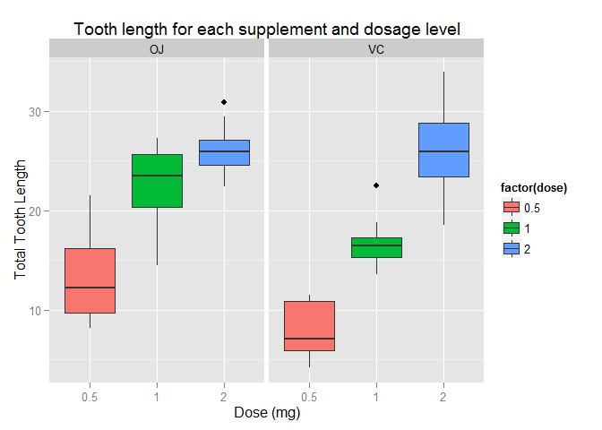

# Statistical Inference Course Project Part 2
# Load the data and the required packages

```r
data(ToothGrowth)
library(dplyr);library(ggplot2)
```

# Data Summary
Lets look at the summary of the tooth growth data 

```r
summary(ToothGrowth)
```

```
##       len        supp         dose      
##  Min.   : 4.20   OJ:30   Min.   :0.500  
##  1st Qu.:13.07   VC:30   1st Qu.:0.500  
##  Median :19.25           Median :1.000  
##  Mean   :18.81           Mean   :1.167  
##  3rd Qu.:25.27           3rd Qu.:2.000  
##  Max.   :33.90           Max.   :2.000
```

```r
head(ToothGrowth,10)
```

```
##     len supp dose
## 1   4.2   VC  0.5
## 2  11.5   VC  0.5
## 3   7.3   VC  0.5
## 4   5.8   VC  0.5
## 5   6.4   VC  0.5
## 6  10.0   VC  0.5
## 7  11.2   VC  0.5
## 8  11.2   VC  0.5
## 9   5.2   VC  0.5
## 10  7.0   VC  0.5
```

# Exploratory Data Analysis

Looking at our box plot, we can see that there are differences in the mean tooth length for each supplement type and for each dosage level. We wil answer these questions by conducting hypothesis tests in the following sections. 


```r
plot1 <- ggplot(ToothGrowth,aes(x=factor(dose),y=len))+
            geom_boxplot(aes(fill=factor(dose)))+
            facet_grid(~supp)+
            labs(x='Dose (mg)',y='Total Tooth Length',
                 title="Tooth length for each supplement and dosage level")
            
plot1
```

 

# Hypothesis Testing 1 - Does mean tooth growth differ by supplement method?

We are interested to find out whether the method of supplement makes a difference to the mean tooth growth.

To answer our question, the null hypothesis is that the difference in mean tooth growth for each supplement is 0. The alternative hypothesis is that the difference in mean tooth growth for each supplement is not 0. In addition, the test is two sided.


```r
t.test(len~supp,data=ToothGrowth,
       alternative=c("two.sided"),mu=0,paired=FALSE,conf.level=0.95,var.equal=FALSE)
```

```
## 
## 	Welch Two Sample t-test
## 
## data:  len by supp
## t = 1.9153, df = 55.309, p-value = 0.06063
## alternative hypothesis: true difference in means is not equal to 0
## 95 percent confidence interval:
##  -0.1710156  7.5710156
## sample estimates:
## mean in group OJ mean in group VC 
##         20.66333         16.96333
```

## Conclusions:
At a 95% confidence level, we fail to reject the null hypothesis as p-value > 5%. Furthermore, we can observe that 0 (null hypothesis) falls between the 95% confidence interval. Therefore, this means that our data suggests that there is no difference in mean tooth growth for each supplement.

## Assumptions for t-test:
1. The tooth length are identically and independently normally distributed (iid normal).
2. Variances in tooth length for each supplement are unknown and unequal.

# Hypothesis Testing 2 - Does mean tooth growth differ by dosage level?

Next, we are interested to find out if there is any statistically significant difference in mean tooth length at different dosage levels.

For each of the tests that follows, our null hypothesis is that the difference in mean tooth length at each level of dosage is 0. The alternative hypothesis is that the difference in mean tooth length at each level of dosage not equals 0. The tests we conduct are two sided tests.

Firstly, conduct the t-test comparing 0.5 versus 1 mg dosage:

```r
t.test(len~dose,data=ToothGrowth[ToothGrowth$dose==0.5|ToothGrowth$dose==1,],
       alternative=c("two.sided"),mu=0,paired=FALSE,conf.level=0.95,var.equal=FALSE)
```

```
## 
## 	Welch Two Sample t-test
## 
## data:  len by dose
## t = -6.4766, df = 37.986, p-value = 1.268e-07
## alternative hypothesis: true difference in means is not equal to 0
## 95 percent confidence interval:
##  -11.983781  -6.276219
## sample estimates:
## mean in group 0.5   mean in group 1 
##            10.605            19.735
```

Secondly, conduct the t-test comparing 0.5 versus 2 mg dosage:

```r
t.test(len~dose,data=ToothGrowth[ToothGrowth$dose==0.5|ToothGrowth$dose==2,],
       alternative=c("two.sided"),mu=0,paired=FALSE,conf.level=0.95,var.equal=FALSE)
```

```
## 
## 	Welch Two Sample t-test
## 
## data:  len by dose
## t = -11.799, df = 36.883, p-value = 4.398e-14
## alternative hypothesis: true difference in means is not equal to 0
## 95 percent confidence interval:
##  -18.15617 -12.83383
## sample estimates:
## mean in group 0.5   mean in group 2 
##            10.605            26.100
```

Thirdly, conduct the t-test comparing 1 versus 2 mg dosage:

```r
t.test(len~dose,data=ToothGrowth[ToothGrowth$dose==1|ToothGrowth$dose==2,],
       alternative=c("two.sided"),mu=0,paired=FALSE,conf.level=0.95,var.equal=FALSE)
```

```
## 
## 	Welch Two Sample t-test
## 
## data:  len by dose
## t = -4.9005, df = 37.101, p-value = 1.906e-05
## alternative hypothesis: true difference in means is not equal to 0
## 95 percent confidence interval:
##  -8.996481 -3.733519
## sample estimates:
## mean in group 1 mean in group 2 
##          19.735          26.100
```

## Conclusions:
For all three t-tests conducted, we can see that the p-values are close to 0 (<5%) and that the 95% confidence interval does not contain 0 (null hypothesis of 0 difference in mean). Hence, we can conclude that at the 95% confidence level, we reject the null hypothesis. 

This means that our data suggests that there is a statistically significant difference in mean tooth length at each level of dosage.

## Assumptions for t-test:
1. The tooth length are identically and independently normally distributed (iid normal).
2. Variances in tooth length at each dosage are unknown and unequal.
